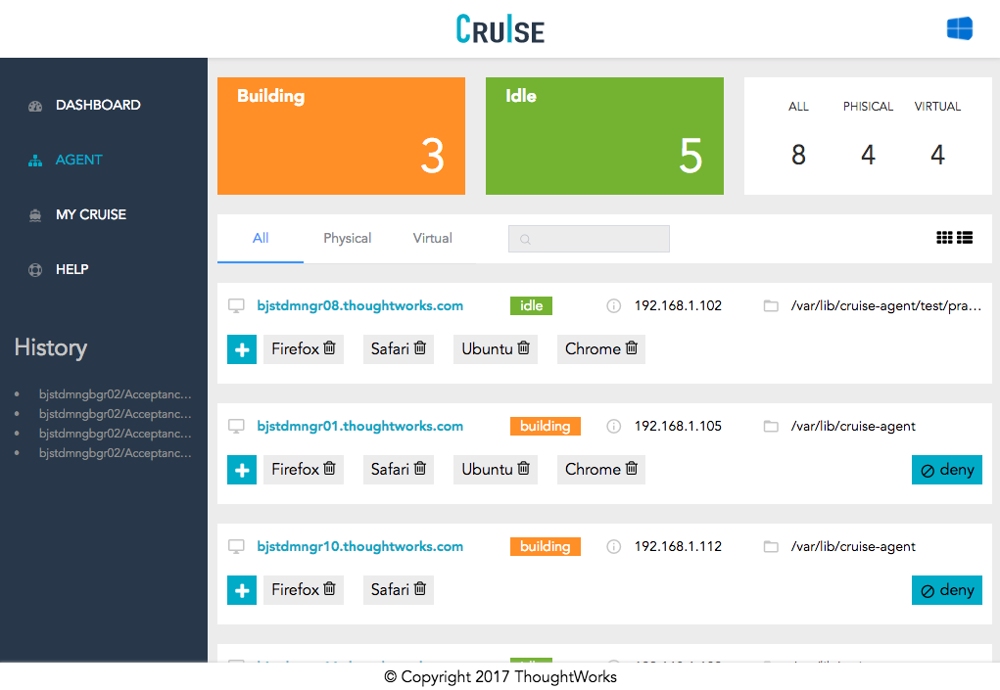
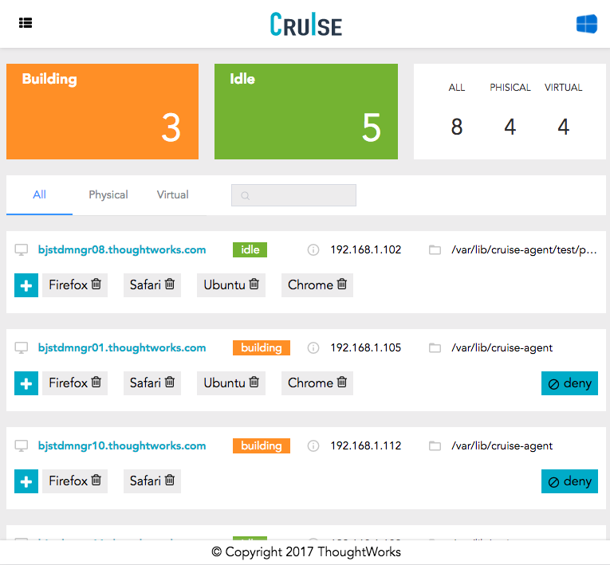
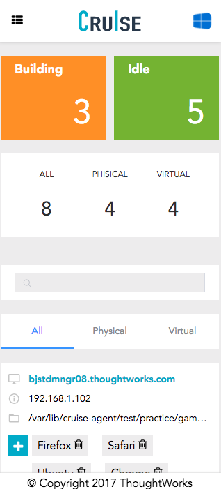

# Cruise
A responsive dashboard for CI(Continuous Integration). It could be browsed on PC, tablet and smartphone.

## Progress
#### Done
- responsive view(on pc HD, pc, tablet and smartphone)
- sass refactor
- test under chrome 63, IE10+, firefox 53 & 57 and safari 10.0.3

#### Todo
- unit test
- basic UI implementation, e.g, navbar, nav-tabs, popover


## Issue
- Webpack-dev-server prone error when developing in IE11, error: "Invalid character" on app.js function: eval("....")

## Preview





## Build Setup

``` bash
# install dependencies
npm install

# serve with hot reload at localhost:8080
npm run dev

# build for production with minification
npm run build

# build for production and view the bundle analyzer report
npm run build --report

# run unit tests
npm run unit

# run e2e tests
npm run e2e

# run all tests
npm test
```
